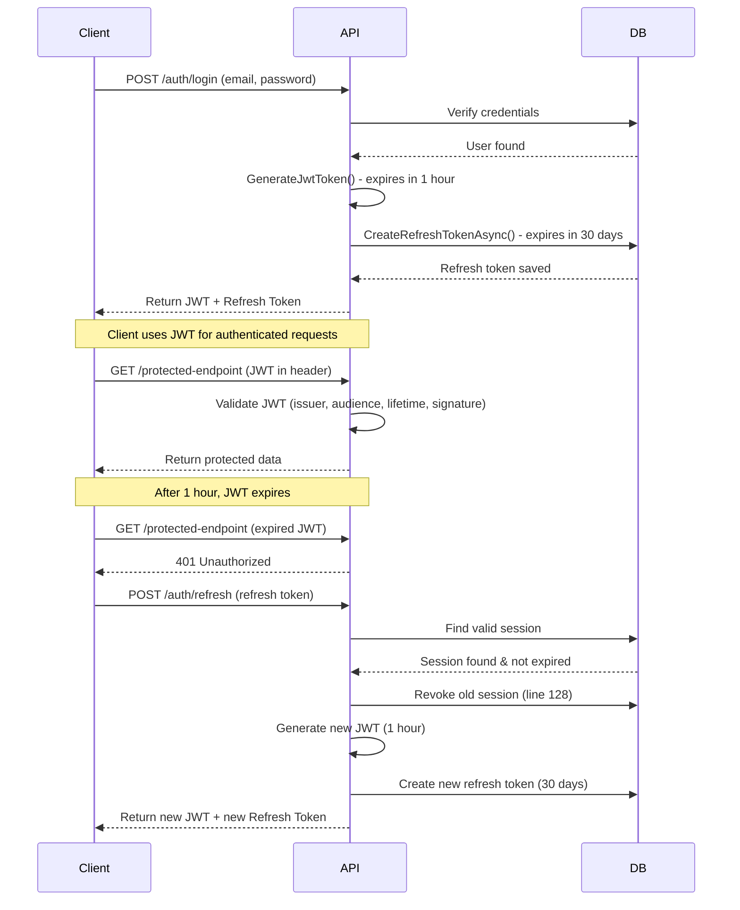

```mermaid
sequenceDiagram
    participant Client
    participant API
    participant DB
    
    Client->>API: POST /auth/login (email, password)
    API->>DB: Verify credentials
    DB-->>API: User found
    API->>API: GenerateJwtToken() - expires in 1 hour
    API->>DB: CreateRefreshTokenAsync() - expires in 30 days
    DB-->>API: Refresh token saved
    API-->>Client: Return JWT + Refresh Token
    
    Note over Client,API: Client uses JWT for authenticated requests
    
    Client->>API: GET /protected-endpoint (JWT in header)
    API->>API: Validate JWT (issuer, audience, lifetime, signature)
    API-->>Client: Return protected data
    
    Note over Client,API: After 1 hour, JWT expires
    
    Client->>API: GET /protected-endpoint (expired JWT)
    API-->>Client: 401 Unauthorized
    
    Client->>API: POST /auth/refresh (refresh token)
    API->>DB: Find valid session
    DB-->>API: Session found & not expired
    API->>DB: Revoke old session (line 128)
    API->>API: Generate new JWT (1 hour)
    API->>DB: Create new refresh token (30 days)
    API-->>Client: Return new JWT + new Refresh Token
```